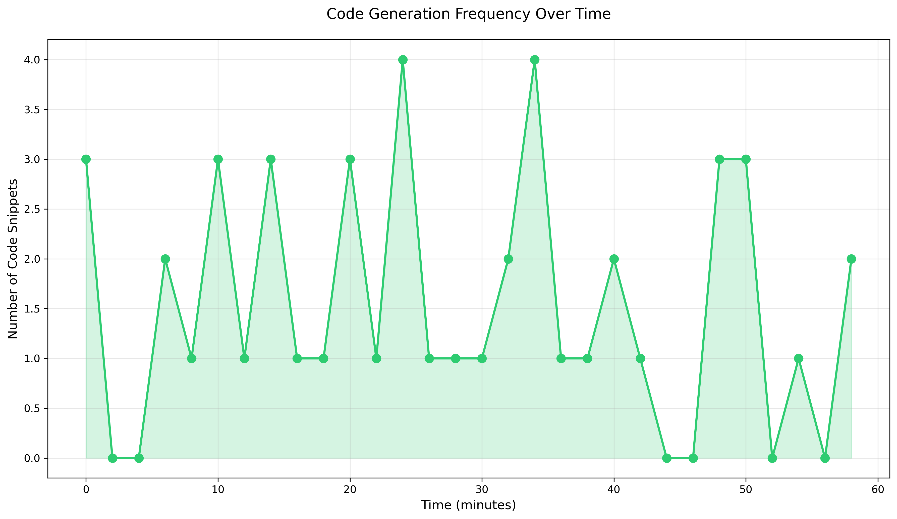
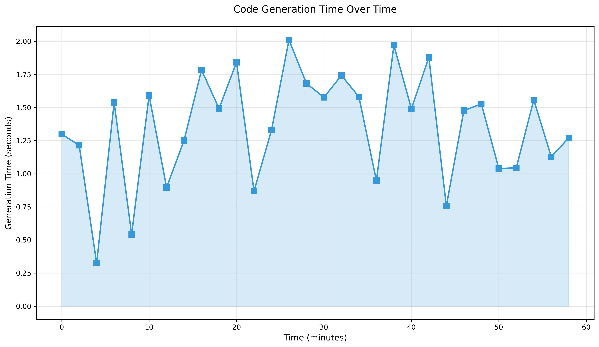

# Auto-Study Code Repository with Metrics Monitoring

This repository is designed to store codes generated during auto-study sessions, with integrated metrics collection using Prometheus and Grafana for monitoring and visualization.

## Step-by-Step Setup Guide

Follow these instructions to set up the repository and monitoring system:

### 1. Repository Setup

- Clone this repository to your local machine:
  ```bash
  git clone <repository-url>
  cd slarrr
  ```

- Create a directory for storing auto-study codes:
  ```bash
  mkdir -p autostudy_codes
  ```

### 2. Metrics Collection Implementation

We'll use a simple Python script to simulate metrics collection from code generation activities.

- Install required dependencies:
  ```bash
  pip install prometheus_client
  ```

- Create a metrics collector script at `metrics/collector.py` (see the file for implementation details).

### 3. Prometheus Setup

Prometheus will be used to scrape and store metrics from our collector.

- Install Prometheus using Docker:
  ```bash
  docker run -d -p 9090:9090 --name prometheus -v $(pwd)/prometheus.yml:/etc/prometheus/prometheus.yml prom/prometheus
  ```

- Configuration file `prometheus.yml` is already set up to scrape metrics from our collector at `localhost:8000`.

### 4. Grafana Setup

Grafana will visualize the metrics collected by Prometheus.

- Install Grafana using Docker:
  ```bash
  docker run -d -p 3000:3000 --name grafana grafana/grafana
  ```

- Access Grafana at `http://localhost:3000` (default login: admin/admin).
- Add Prometheus as a data source with URL `http://localhost:9090`.
- Import or create dashboards to visualize metrics.

### 5. Running the System

- Start the metrics collector:
  ```bash
  python metrics/collector.py
  ```

- Ensure Prometheus and Grafana containers are running:
  ```bash
  docker start prometheus grafana
  ```

## Metrics Visualization

Below are examples of the dashboards showing metrics from the auto-study code generation:

### Code Generation Frequency

*Figure 1: Graph showing the frequency of code snippets generated over time*

### Generation Time Analysis

*Figure 2: Graph showing the time taken to generate code snippets*

## Troubleshooting

- If Prometheus fails to scrape metrics, ensure the collector is running on port 8000.
- If Grafana can't connect to Prometheus, verify the data source URL and that both containers are on the same network.

## Contributing

Feel free to add your auto-study codes to the `autostudy_codes` directory and enhance the metrics collection system. 